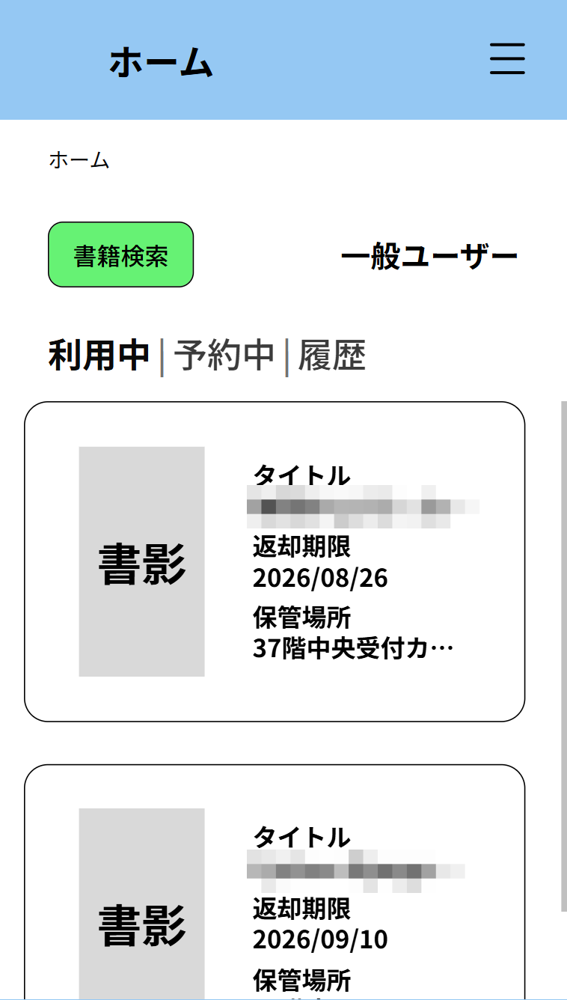
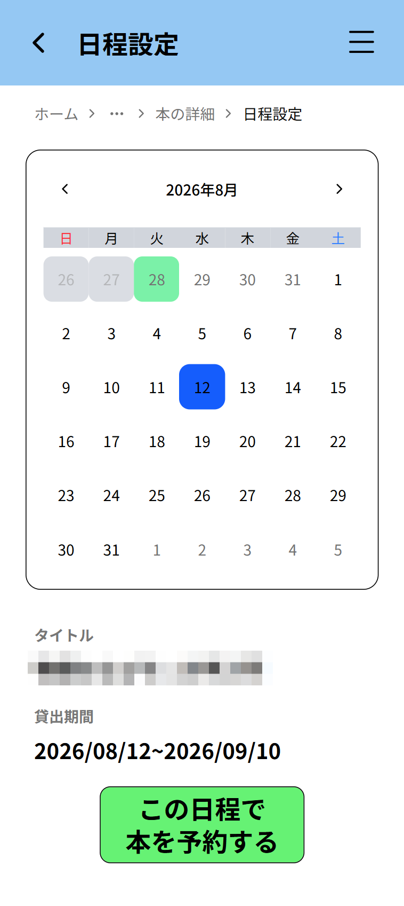

# 分散型図書館アプリ

 

## サービス概要
社内の複数の場所に保管された書籍を、一つの図書館として利用するための社内向けアプリです。スマートフォン向けのUIで、書籍の検索や保管場所の確認を手軽に行えます。

 

## アプリへの想い
様々な場所に点在する書籍について、一つの図書館として気軽に利用できるようにしたいと考えました。 
書籍を探したいときに、その場で必要な情報へアクセスできるようにスマートフォン向けに設計しており、 
書籍の検索から保管場所・利用状況の確認、貸出・予約・返却までを一元化することを目指しています。

 

## 機能一覧
| ログイン画面 | ユーザートップ画面 |
| ---- | ---- |
|  |  |
| 社員番号とパスワードにて利用者を認証する機能を実装しました。 | ユーザーが利用中の書籍・予約中の書籍・貸出履歴を確認できます。 |

 

| 書籍検索画面 | 検索結果画面 |
| ---- | ---- |
|  |  |
| ユーザーが探したい書籍を複数の条件から検索できる機能を実装しました。 | 検索条件に一致した書籍が10件ごとに一覧表示されます。 |

 

| 書籍詳細画面 | 日程設定画面 |
| ---- | ---- |
|  |  |
| 書籍の書影と利用状況を確認し、利用可能な操作を選択する画面となっています。 | 貸出または予約を開始する日付を選択します。当日を選ぶと貸出、未来の日付を選ぶと予約処理に進みます。 |

 

| 貸出完了画面 | 予約完了画面 |
| ---- | ---- |
|  |  |
| 貸出処理が完了した旨と、貸出期間・書籍の保管場所が表示されます。 | 予約処理が完了した旨と、貸出期間・書籍の保管場所が表示されます。 |

 

| 返却受付画面 | 返却完了画面 |
| ---- | ---- |
|  |  |
| 返却対象の書籍、返却期限、保管場所を確認して返却処理を実行するための画面です。保管場所への返却を完了した後、ユーザーにボタンを押してもらう想定です。 | 返却処理が完了した旨が表示されます。 |

 

## 使用技術

| Category | Technology Stack |
| --- | --- |
| Frontend | TypeScript, Next.js, Tailwind CSS |
| Backend | Python, Django, Django REST Framework |
| Database | PostgreSQL |
| Design | Figma |
| AI Model | GPT-5.5, GPT-5.6 Luna, GPT-5.6 Terra |
| AI Agent | Pi Coding Agent, Hermes Agent |
| etc. | Biome, Ruff, shadcn/ui, Swagger UI, Git, GitHub, Docker |

## ER図

 

## 画面遷移図

 

## 今後の課題・改善方針

実装する機能を増やすだけでなく、要件の整理、設計判断、検証方法を一貫させることが今後の課題です。以下は本アプリの開発を通じて得た振り返りであり、優先度と利用者・運用者の要件を確認したうえで段階的に対応します。

### 設計・開発プロセス

- **コーディング規約の明文化**
  - 命名、戻り値の扱い、public な関数の型注釈、例外の扱いを統一する。型注釈は一律に増やすのではなく、サービス層や API 境界など、契約を明確にすべき箇所を優先する。
  - ディレクトリ構成と各ファイルの責務を継続的に見直し、画面表示・入力検証・業務処理・データアクセスが混在しない構成にする。
- **作業計画と変更管理の改善**
  - 画面・API・DB・テストを含めて「1つの作業」の完了条件を定義し、実装前にスケジュールと依存関係を整理する。
  - 変更の目的が追える粒度で commit し、Conventional Commits などを参考に commit message の形式を統一する。

### テストと品質保証

- 単体テスト、API テスト、画面操作テストの責務を分け、正常系だけでなく入力境界値、認可、同時実行、画面遷移後の再読み込みを含むテストケースを整備する。
- backend には Django の自動テストがある一方、frontend は手動確認項目が中心である。component test・E2E test を導入し、重要な利用者導線を継続的に検証できるようにする。
- エラー応答は利用者向けの安全な文言を維持しつつ、サーバー側では個人情報や認証情報を出力しない structured logging・監視方針を設計する。

### UI / UX と共通化

- `globals.css` の design token と既存の共通コンポーネントを基盤に、画面ごとに重複している色・余白・ボタンの class を整理する。必須項目、入力例、エラー、disabled 状態を一目で理解できるフォーム表現へ統一する。
- 戻る操作は、ブラウザ履歴へ戻るべき場面と、常に特定画面へ戻るべき場面を区別して設計する。現在の共通戻るボタンは遷移先を明示する方式のため、直リンク時も含めた利用者導線を基準に選択する。
- ページネーションは現在ページ・総件数・前後移動の分かりやすさを改善し、検索条件を保った遷移とアクセシビリティを確認する。
- 完了画面では返却期限を分かりやすく表示し、直接アクセスや再読み込み時にも処理結果を確認できるようにする。特に、表示のみの完了画面は処理済み状態の確認方法を検討する。
- 管理画面についても、書籍登録・検索などの機能間を移動しやすいナビゲーションに改善する。

### 業務ルール・データ設計

- 書籍検索は都度 `Book` を検索する構成であり、検索履歴の保存、検索用 index、cache が本当に必要かを、利用目的・データ量・プライバシーの観点から判断する。
- `Book`、`BookCopy`、`Lending`、`Reservation` の関係と状態遷移を、実際の運用フローから再検討する。制約だけでなく、貸出・返却・延長・予約・失効時にどの情報を保持するかを明確にする。
- 現在は貸出期間・延長日数・予約取り置き期間を定数で扱っているため、休館日、臨時休館、返却期限の繰越を扱うカレンダー／業務日ルールを設計する。
- 予約は利用可能な `BookCopy` を対象としている。貸出中の資料への予約待ち、優先順位、通知、失効後の繰り上げなど、実運用に必要な予約機能を要件から設計する。

### 認証・入力検証・API の堅牢性

- session authentication と CSRF cookie を利用した認証フローについて、cookie 属性、same-origin / cross-origin、ログアウト、セッション期限を含めて理解・文書化し、本番環境の構成に合わせて検証する。
- 社員番号は画面側で前後空白の除去と全角数字の正規化を行い、API 側では数値として検証している。社員番号を数値として扱う要件（先頭 0、桁数、内部空白の扱い）を明確にし、入力・DB・API の型を揃える。
- パスワードは意図せず変換・trim してはならない。一方で空白のみの入力に対する UI 上の扱いは改善余地があるため、認証値そのものを変えずに入力エラーを分かりやすく表示する。
- HTTP API 以外からサービス関数が呼ばれる場合も想定し、認可・所有者確認・状態確認をどの層で保証するかを明文化する。呼び出し元を信頼しすぎない guard と、重複しない validation の責務分担を行う。
