# 分散型図書館アプリ

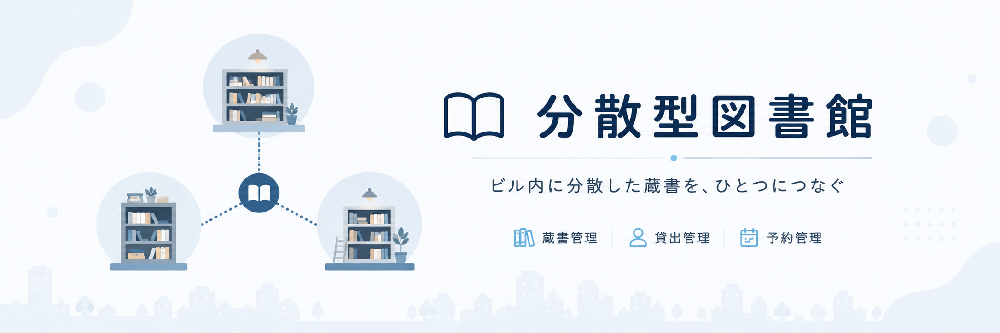

 

## サービス概要
社内の複数の場所に保管された書籍を、一つの図書館として利用するための社内向けアプリです。スマートフォン向けのUIで、書籍の検索や保管場所の確認を手軽に行えます。

 

## アプリへの想い
様々な場所に点在する書籍について、一つの図書館として気軽に利用できるようにしたいと考えました。 
書籍を探したいときに、その場で必要な情報へアクセスできるようにスマートフォン向けに設計しており、 
書籍の検索から保管場所・利用状況の確認、貸出・予約・返却までを一元化することを目指しています。

 

## 機能一覧
| ログイン画面 | ユーザートップ画面 |
| ---- | ---- |
| 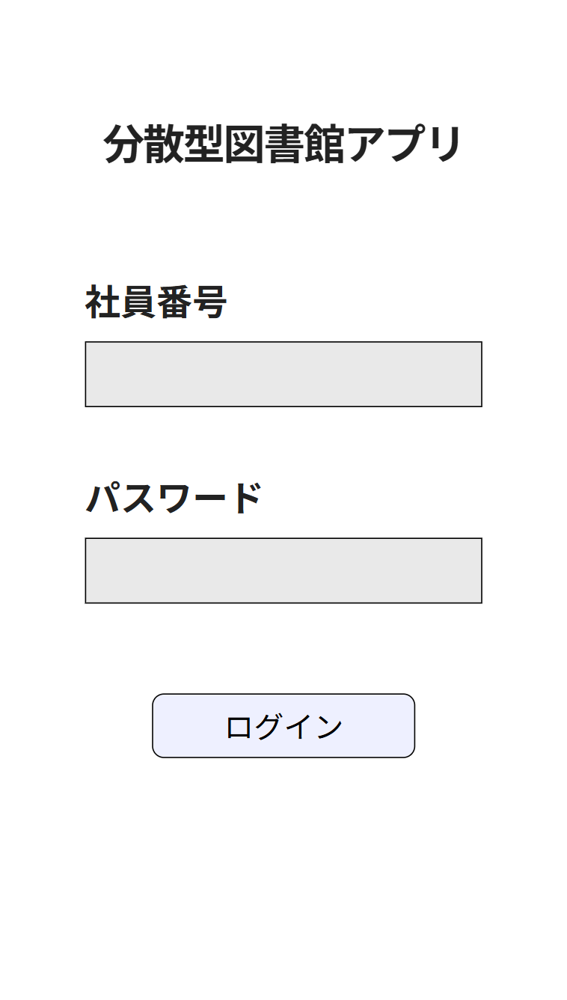 | 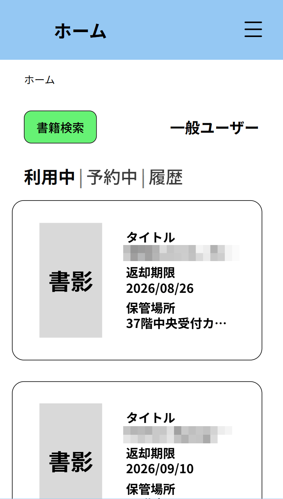 |
| 社員番号とパスワードにて利用者を認証する機能を実装しました。 | ユーザーが利用中の書籍・予約中の書籍・貸出履歴を確認できます。 |

 

| 書籍検索画面 | 検索結果の書籍一覧画面 |
| ---- | ---- |
| 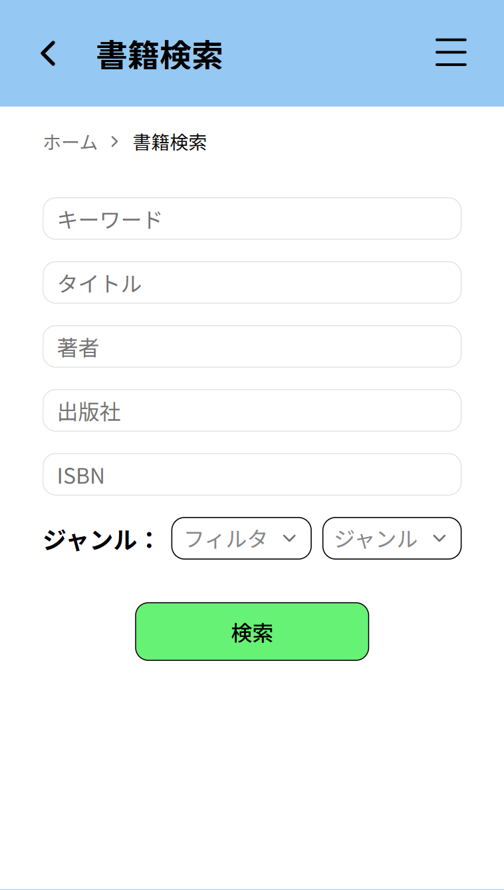 | 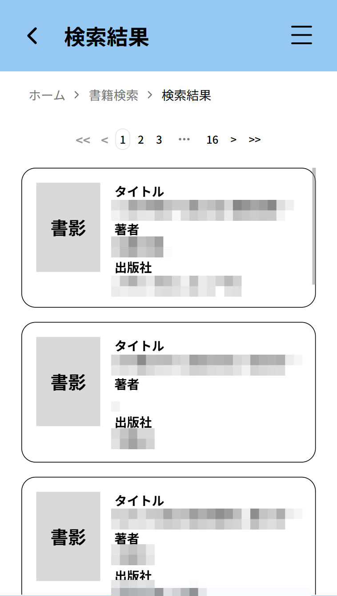 |
| ユーザーが探したい書籍を複数の条件から検索できる機能を実装しました。 | 検索条件に一致した書籍が10件ごとに一覧表示されます。 |

 

| 書籍詳細画面 | 日程設定画面 |
| ---- | ---- |
| 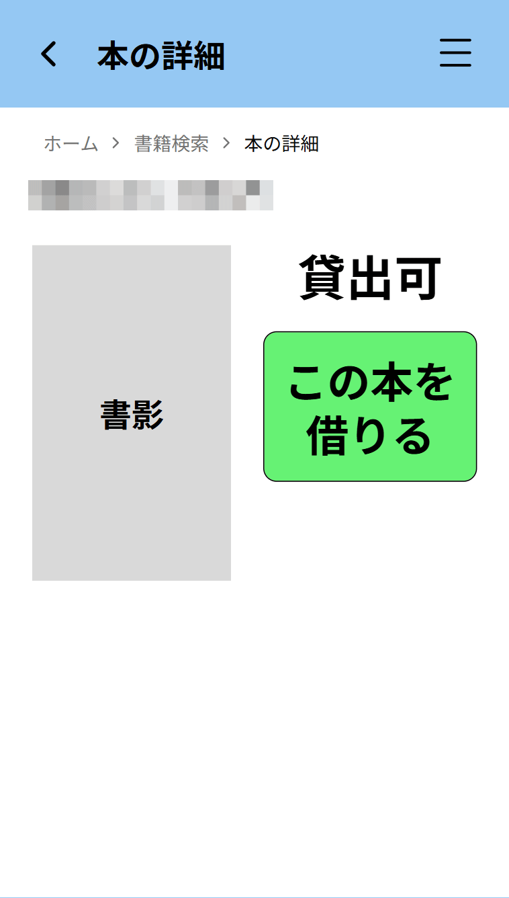 | 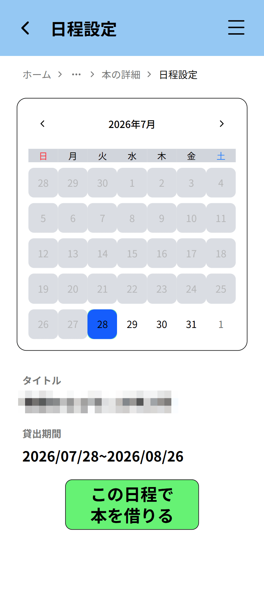 |
| 書籍の書影と利用状況を確認し、利用可能な操作を選択する画面となっています。 | 貸出または予約を開始する日付を選択します。当日を選ぶと貸出、未来の日付を選ぶと予約処理に進みます。 |

 

| 貸出完了画面 | 予約完了画面 |
| ---- | ---- |
| 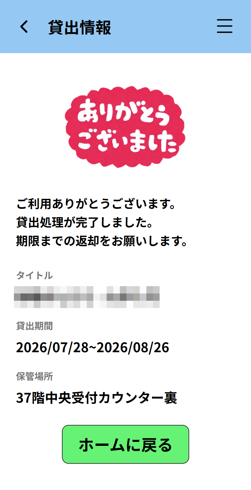 | 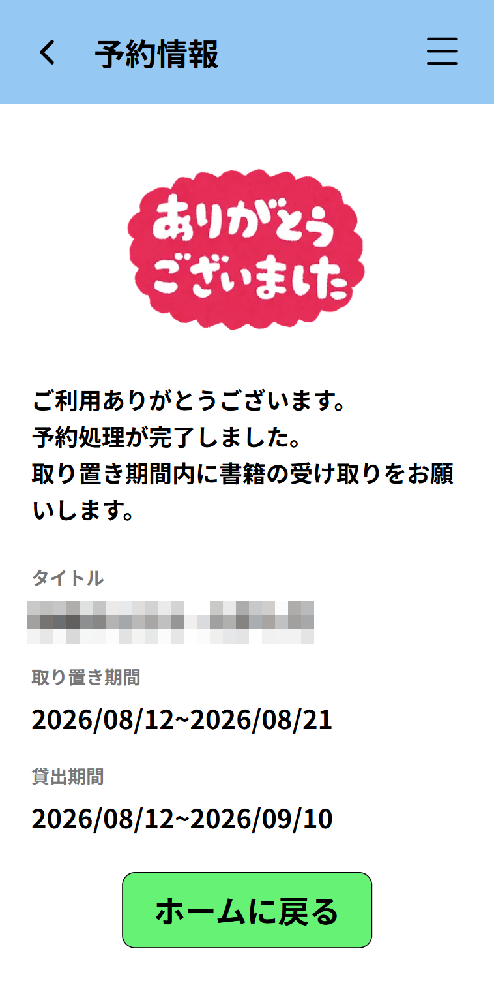 |
| 貸出処理が完了した旨と、貸出期間・書籍の保管場所が表示されます。 | 予約処理が完了した旨と、貸出期間・書籍の保管場所が表示されます。 |

 

| 返却受付画面 | 返却完了画面 |
| ---- | ---- |
| 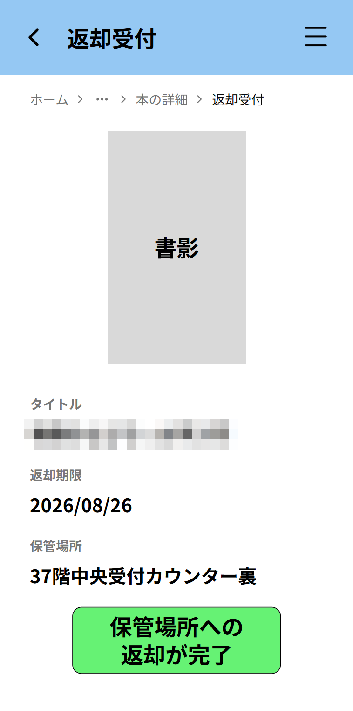 | 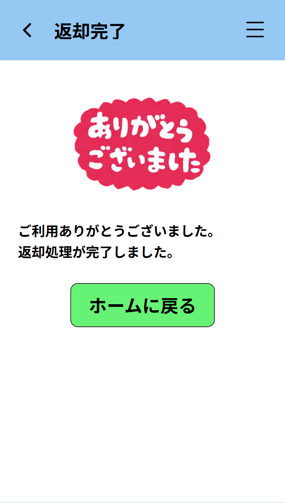 |
| 返却対象の書籍、返却期限、保管場所を確認して返却処理を実行するための画面です。保管場所への返却を完了した後、ユーザーにボタンを押してもらう想定です。 | 返却処理が完了した旨が表示されます。 |

 

## 使用技術

| Category | Technology Stack |
| --- | --- |
| Frontend | TypeScript, Next.js, Tailwind CSS |
| Backend | Python, Django, Django REST Framework |
| Database | PostgreSQL |
| Design | Figma |
| AI Model | GPT-5.5, GPT-5.6 Luna, GPT-5.6 Terra |
| AI Agent | Pi Coding Agent, Hermes Agent |
| etc. | Biome, Ruff, shadcn/ui, Swagger UI, Git, GitHub, Docker |

## ER図

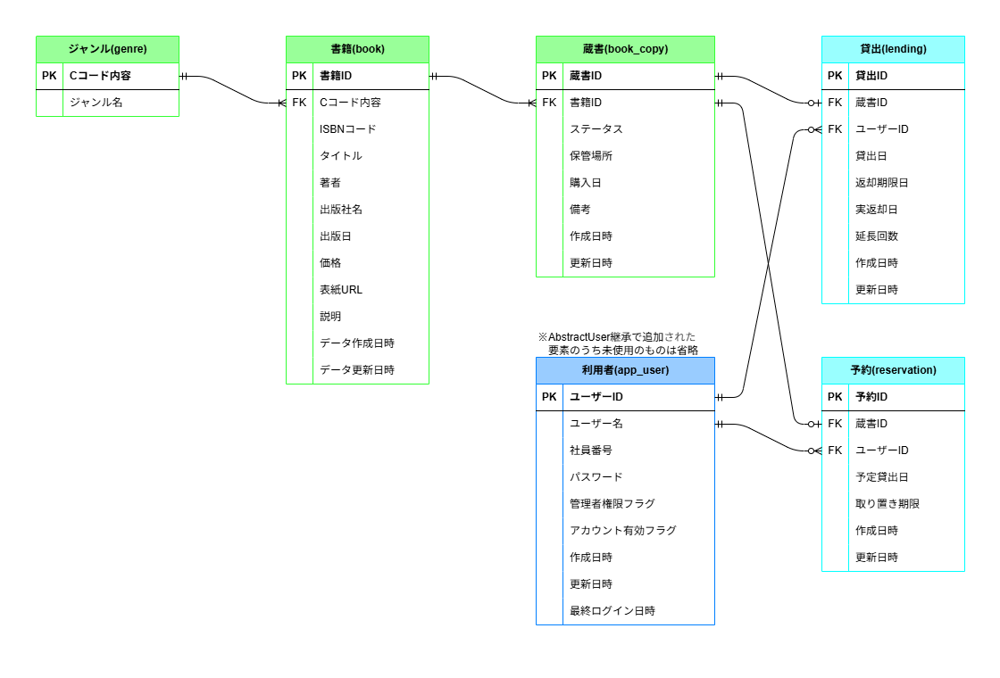

 

## 画面遷移図

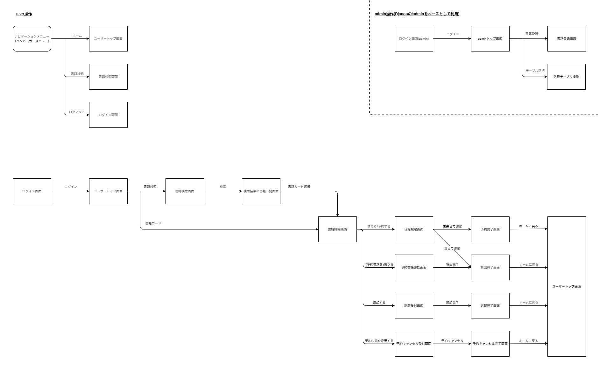

 

## 今後の課題

本アプリの開発を通じて感じた課題について以下にまとめました。

### 設計・実装品質

- 命名、関数の戻り値の記述方法、型注釈、例外・エラーの扱いを統一する。特に、サービス層や API 境界など契約を明確にすべき箇所では、引数・戻り値の型を明示する。
- `globals.css` と共通コンポーネントを活用して、色・余白・ボタンなどの共通スタイルと、画面ごとに重複している UI の実装を整理する。
- 機能やレイヤーごとのディレクトリ構成を見直し、画面表示・入力検証・業務処理・データアクセスの責務を分離する。

### 開発プロセス・品質保証

- 「1つの作業」の範囲と完了条件を定義して、実装前にスケジュールと依存関係を整理する。
- テストフレームワーク等によるテストの自動化を進め、正常系だけでなく、入力境界値・認可・同時実行・再読み込みを含むテストケースを継続的に検証できるようにする。
- CI/CD を活用し、`lint`・`format`・型チェック・自動テスト・`build` などの品質確認を自動化する。
- 変更の目的が追える粒度で commit して、Conventional Commits などを参考に commit message の形式を統一する。

### 認証・セキュリティ・堅牢性

- session authentication と CSRF cookie を利用した認証フローについて、cookie 属性、same-origin / cross-origin、ログアウト、セッション期限を理解し、本番環境の構成に合わせて検証する。
- HTTP API 以外からサービス関数が呼び出される場合も想定し、認可・所有者確認・状態確認をどの層で保証するかを明確にする。呼び出し元を信頼しすぎない guard と、重複しない validation の責務分担を行う。
- エラー応答は利用者向けに安全で分かりやすい文言とし、エラーの種類に応じた処理を設計する。

### 業務ルール・データ整合性

- テーブルの責務や依存関係を整理して、貸出・返却・予約などの業務処理との整合性を保ちやすいデータモデルに見直す。
- 休館日・臨時休館・返却期限の繰越などを扱うカレンダー／業務日ルールを設計し、実際の運用に対応できるようにする。

### UI / UX・利用者検証

- スマートフォン向け UI は実機でも確認して、スクロール領域とタップ可能な要素が重なって誤操作を起こさないよう、タップ領域と画面操作を見直す。
- UI/UXについての学習を進めて、アプリの改善を行う。
- ログイン画面より前に、アプリの目的や利用方法を伝えるトップ画面を用意し、初めて利用する人にも分かりやすい導線を導入する。

### 本番運用・保守・拡張

- サーバー側では個人情報や認証情報を出力しない logging・監視方針を設計して、障害の検知と原因調査を行いやすくする。
- 利用者向け・運用者向けのドキュメントや手順を充実させる。
- データやコンテンツの管理方針、運用体制、今後の拡張方法を検討する。

